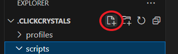
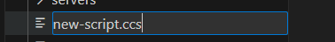

# Creating Script Files
Now that you have everything set up in VSCode, you can start creating your script files. To do this click on the “New File” icon at the top of the navigation bar.

Name the file whatever you want, but the convention is to have all lowercase with hyphens instead of spaces or underscores. The file name extension, however, remains as **.ccs** at all times.

Once the file has been created, a preview would open to the right. Now you can start scripting! Remember to **Ctrl+S** to save any changes.