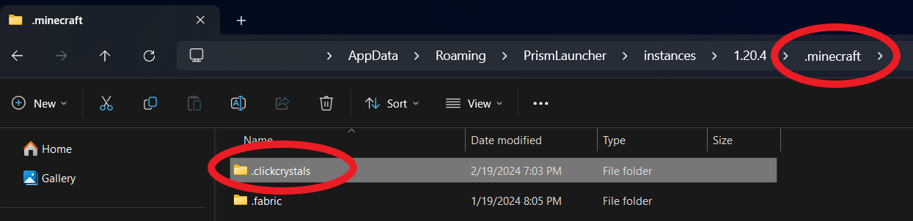
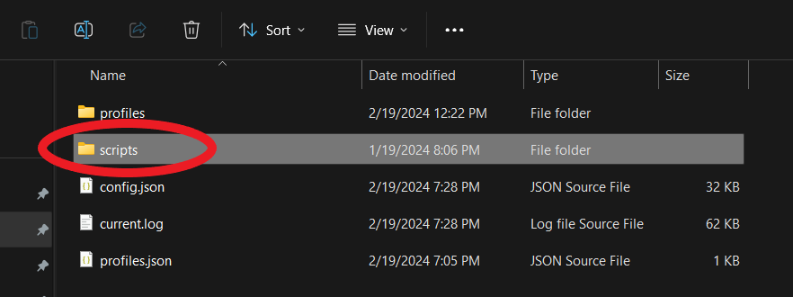

# Navigating Files
When ClickCrystals first launches, it would create a folder named **.clickcrystals** inside of your **.minecraft** folder.

To access your **.minecraft** folder, press **Win+R** and type the following. A folder should pop up and in it select **.minecraft**. Inside of that folder you should see another one at the top named** .clickcrystals**.

There are a few key components in your **.clickcrystals** folder. These include your config, clickcrystals log, profile data, profiles folder, and scripts folder. This wiki will be covering the **scripts folder** located in **.minecraft/.clickcrystals/scripts**.
