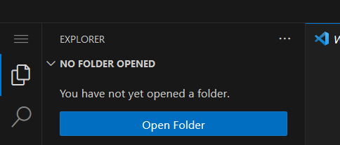

# Opening ClickCrystals Folder In-Game
To use VSCode, you must first open a folder locally. To do this type the command `,folder` in chat. Remember that the default command prefix bind is set to **comma**.

You can then open this folder to VSCode by clicking on the “Open Folder” button and then selecting the **.clickcrystals** folder.
